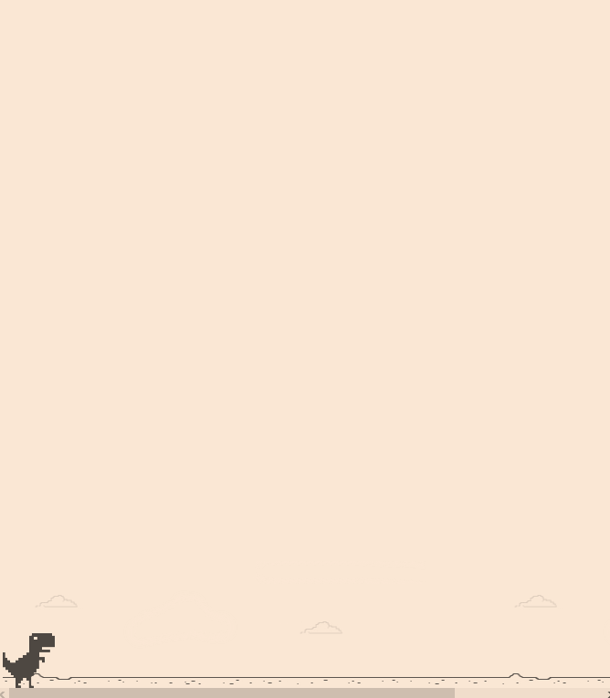

# Jogo Dinossauro Sem Internet

## Sobre o projeto

Este projeto é resultado do desafio de recriar a jogo do dinossauro sem internet do bootcamp Órbi Web Games Developer na plataforma [Digital Innovation One](https://www.dio.me).

Link do Repositório do Projeto original: [Dino Game](https://github.com/celso-henrique/dio-dino-game) , pelo professor Celso Henrique ([GitHub](https://github.com/celso-henrique/)).

## Tecnologias utilizadas

Feito com VSCODE em:

- HTML/ CSS
- Javascript

## Para rodar o projeto

Para executarmos o projeto, basta apenas abrir o arquivo index.html em um navegador de preferência.
