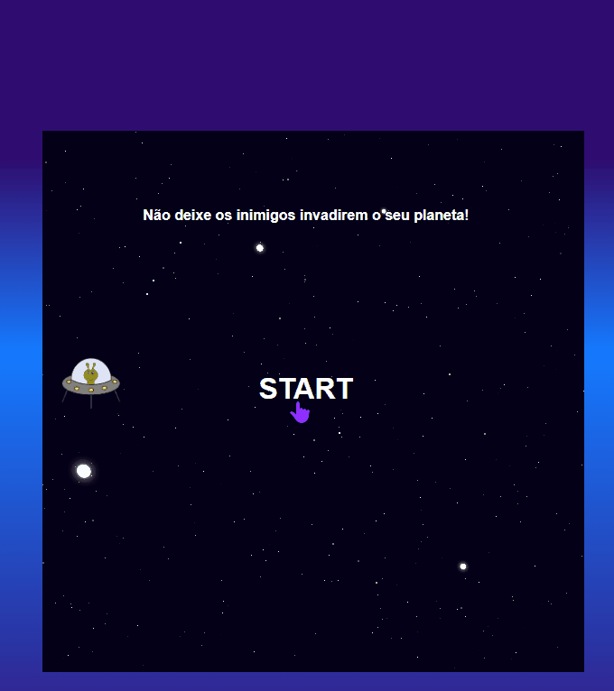

# Jogo Space Shooter

## Sobre o projeto

Este projeto é resultado do desafio de criar um jogo Space Shooter do bootcamp Órbi Web Games Developer na plataforma [Digital Innovation One](https://www.dio.me).

Link do [Repositório do Projeto original](https://github.com/SpruceGabriela/space-shooter-dio) , feito pela professora Gabriela Pinheiro.

## Tecnologias utilizadas

Feito com VSCODE em:

- HTML/ CSS
- Javascript

## Para rodar o projeto

Para executarmos o projeto, basta apenas abrir o arquivo index.html em um navegador de preferência.
